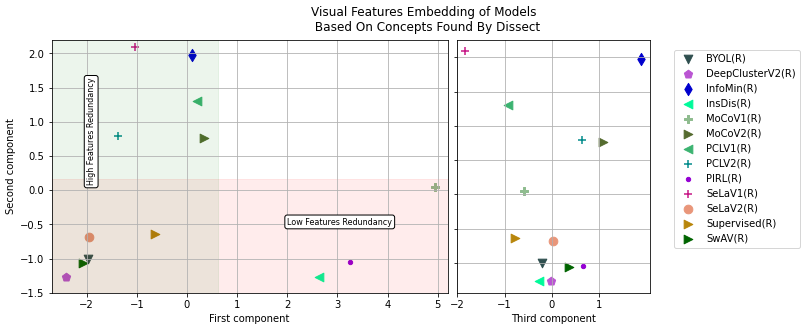

# Intermodel Interpretability Self Supervised Models as a Case Study

The black-box nature of Deep Learning have raised doubts about it's safe deployment in different domains. This sparked a research domain aimed at interpreting deep learing models. Different approaches have been proposed, all considering one target model. In this paper we explore extending a stat-of-the-art model interpretability technique to multiple models. This exension helps explain the differences and similarities between models way beyond hte conventional performance metrics such as accuracy or precision. 

